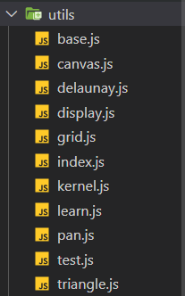
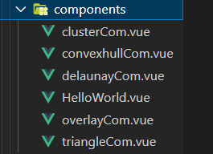
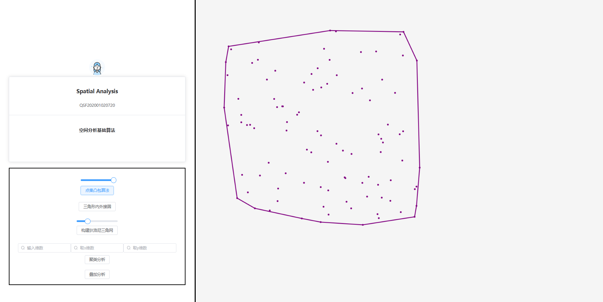
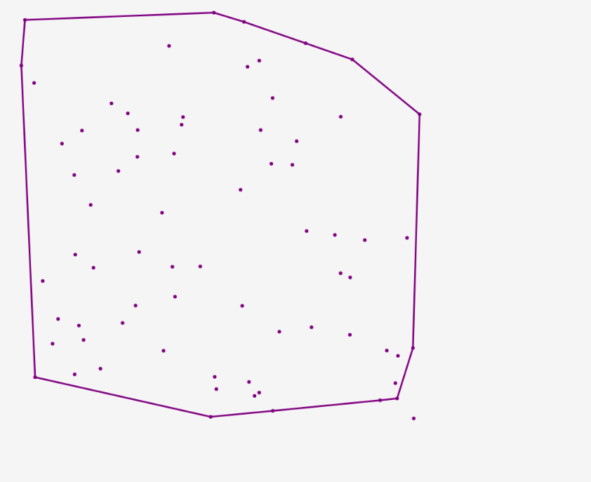
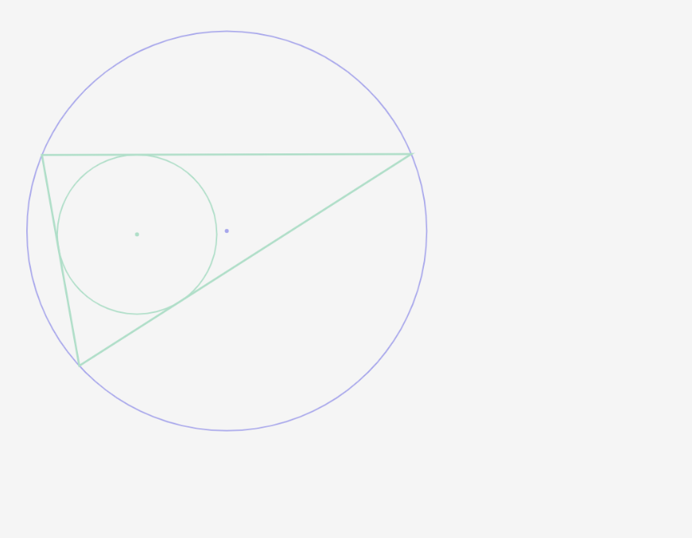

# GeoVite
空间分析实习
- js自带canvas库
- 基于canvas官方文档——自开发绘图库GeoRV
- GeoRV+vite将空间分析算法可视化到画布上
## 概要
- 自编写GeoRV库

- 组件如下

```js
/**
 * 画笔类 负责将内容绘制到canvas上 仅用于渲染矢量图形
 * - 可能叫renderer更加专业一点
 */
export class pan { 
    /**
     * 构造画笔 
     * @param {CanvasRenderingContext2D} ctx - 获取二维canvas上下文
     * @param {string} color - 画笔颜色
     */
    constructor(ctx,color) {
        this.ctx = ctx;
        this.color = color;
    }
    /**
     * 绘点
     * @param {number} x - 横坐标
     * @param {number} y - 纵坐标
     * 直接在上下文中绘制
     */
    draw_point(x,y,Mycolor = null){
        const color = this.ctx.fillStyle;

        if(Mycolor){

            this.ctx.fillStyle = Mycolor;
        }else{
            this.ctx.fillStyle = this.color;
        }

        // this.ctx.fillRect(x, y, 10, 10);
        // draw a point with radius 10
        this.ctx.beginPath();
        this.ctx.arc(x, y, 3, 0, 2 * Math.PI);
        this.ctx.fill();
        this.ctx.fillStyle = color;
    }

    /**
     * 绘制点集
     * @param {array} pointlist 
     */
    draw_pointset(pointlist){
        for (let it of pointlist){
            this.draw_point(it.x,it.y);
        }
    }

    /**
     * 绘制单一直线
     * @param {Point} sp - start point
     * @param {Point} ep - end point
     * @param {Strin} color
     */
    draw_line(sp,ep,color){
        this.color=color;
        this.ctx.lineWidth = 3 ;
        this.ctx.beginPath();
        this.ctx.moveTo(sp.x,sp.y);
        this.ctx.lineTo(ep.x,ep.y);
        this.ctx.strokeStyle = this.color;
        this.ctx.lineWidth = 3 ;
        this.ctx.closePath();
        this.ctx.stroke();
    }


    /**
     * 绘制填充多边形
     * @param {array} pointlist 
     */
    draw_polygon(pointlist){
        //this.ctx.fillStyle = "#0000ff5a";
        this.ctx.strokeStyle = this.color;
        this.ctx.lineWidth = 3 ;
        this.ctx.beginPath();

        this.ctx.moveTo(pointlist[0].x,pointlist[0].y);
        for(let i=1;i<pointlist.length;i++){
            this.ctx.lineTo(pointlist[i].x,pointlist[i].y);
        }
        //this.ctx.fill();
        this.ctx.closePath();
        this.ctx.stroke();
        
    }
```
- 总体界面


- 点集凸包算法

- 三角形内外接圆

- 狄洛尼三角网

- etc......